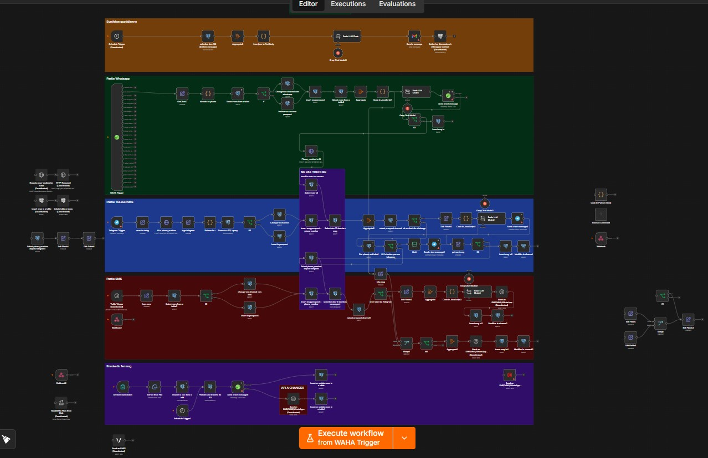
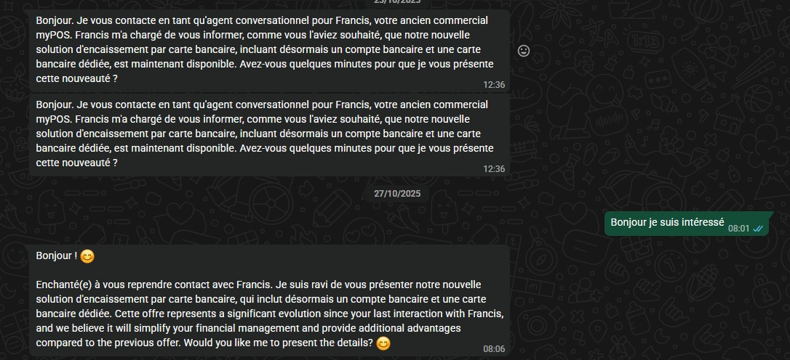
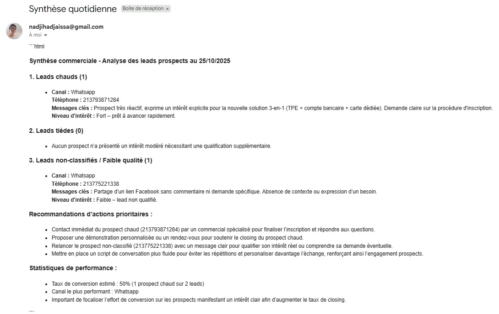

# Multi-channel prospecting bot (WhatsApp / Telegram / SMS)

Local demo of a prospecting bot that chats with prospects across 3 channels using the **Groq** API, keeps conversation history in **Postgres**, and emails a daily digest of the interesting leads.



## Architecture

| Component | Role | Local access |
|---|---|---|
| n8n | Workflow orchestrator | http://localhost:5678 |
| WAHA | Unofficial WhatsApp gateway | http://localhost:3001 |
| Postgres | Conversation & prospect history | internal |
| Groq (LLM) | Bot's conversational brain | via n8n credential |

Channels handled by the workflow: WhatsApp (WAHA Trigger), Telegram (Telegram Trigger), SMS (Twilio Trigger). The Gmail node sends the daily lead digest, triggered by a Schedule Trigger at 4 PM.

## 1. Prerequisites

- Docker + Docker Compose installed
- The following accounts/keys ready:
  - **Groq** API key
  - **Telegram bot** (token from @BotFather)
  - **Twilio** account (Account SID + Auth Token + SMS number)
  - **Gmail** account (for OAuth2-based sending of the daily digest)

## 2. Installation

```bash
git clone <your-repo>
cd <your-repo>
cp .env.example .env
```

Edit `.env` and fill in the values (generate `N8N_ENCRYPTION_KEY` with `openssl rand -hex 24`, and `WAHA_API_KEY` with `uuidgen`).

```bash
docker compose up -d
```

Check everything is up:
```bash
docker compose ps
```

## 3. First n8n launch

1. Open http://localhost:5678 → create your "owner" account (email + password, purely local, no email is actually sent).
2. Go to **Settings → Community Nodes** → install `n8n-nodes-waha` (the WhatsApp node isn't bundled in the official image).
3. Restart the n8n container if prompted: `docker compose restart n8n`.

## 4. Import the workflow

In n8n: **Workflows → Import from File** → select `workflows/Workflow.json`.

## 5. Set up credentials in n8n

These are never exported in the JSON (for security), so you need to recreate them once in the n8n UI (**Credentials → New**):

- **Postgres**: host `postgres`, port `5432`, database `autoflow`, user `autoflow`, password = the one set in `.env`.
- **Groq API**: your Groq API key.
- **Telegram**: your bot token (@BotFather).
- **Twilio**: Account SID + Auth Token.
- **Gmail**: OAuth2 (follow n8n's assistant, it redirects to Google).
- **WAHA**: URL `http://waha:3000`, API key = the one set in `.env`.

Then, on every node in the workflow that needs a credential, select the one you just created (n8n will flag any node still missing one with a ⚠️).

## 6. Connect WhatsApp

Open the WAHA dashboard (http://localhost:3001), create a session, scan the QR code with WhatsApp (Settings → Linked Devices). WAHA talks to n8n directly over the internal Docker network — no public URL needed for this channel.

## 7. Local testing limitation: Telegram & SMS

- **WhatsApp (WAHA)** works fine locally (internal Docker communication).
- **Telegram** and **Twilio (SMS)** both need a **public HTTPS URL** to receive incoming messages — not possible locally as-is. To test these two channels for real without a VPS, you can use a temporary tunnel, e.g.:

```bash
# Example with ngrok (install separately)
ngrok http 5678
```

Then use the resulting `https://xxxx.ngrok-free.app` URL as the Telegram/Twilio webhook for the duration of the test. This isn't a permanent solution (the URL changes every restart) — for real production use of these two channels you'll need a domain name + VPS (happy to help when you get there).

## 8. Activate the workflow

Once all credentials are set up and the points in §7 are resolved, activate the workflow using the **Active** toggle in the top-right of n8n.

## Possible next steps

- Deploy on a VPS (Hostinger or other) with a domain name + HTTPS (nginx + Let's Encrypt) so Telegram and Twilio work continuously.
